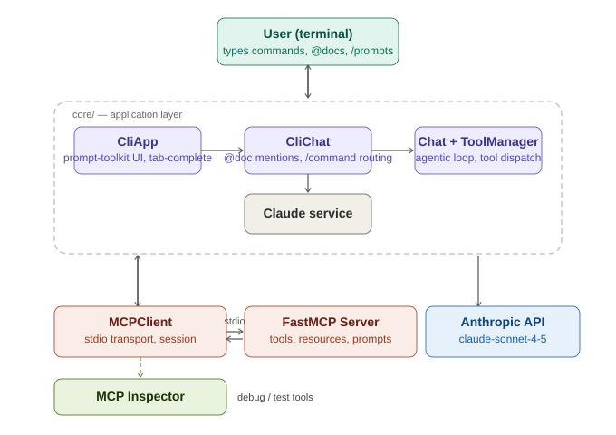
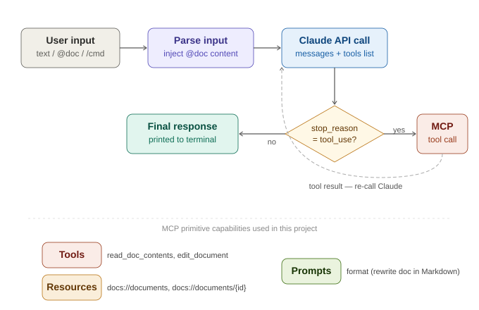

# MCP CLI Note App

A command-line AI assistant built with the **Model Context Protocol (MCP)** and the Anthropic Python SDK. This project demonstrates how to wire a FastMCP server (tools, resources, and prompts) to a Claude-powered CLI client, with tab-completion, inline `@doc` mentions, and `/slash-command` prompts, as a complete working learning example. 

> **Certification:** [Build Apps with Claude and the Model Context Protocol (MCP)](https://verify.skilljar.com/c/dfhr9h6jxftc) | Anthropic / SkillJar

---

## Skills demonstrated

This project is built as a portfolio piece showcasing applied AI engineering skills relevant to **AI Engineer, ML Engineer, Data Engineer, and Backend Developer** roles.

| Skill area | What was applied |
|---|---|
| **Agentic AI systems** | Multi-turn tool-use loop where Claude autonomously calls MCP tools and iterates until a final answer is reached |
| **MCP protocol** | Implemented all three MCP primitives: tools, resources, and prompts using the official Python SDK |
| **API integration** | Anthropic Claude API (`claude-sonnet-4-5`) with structured message history, tool definitions, and stop-reason handling |
| **Async Python** | `asyncio`, `AsyncExitStack`, context managers throughout the client and server communication layer |
| **CLI development** | Rich terminal UX with `prompt-toolkit`: history, tab-completion, key bindings, auto-suggest |
| **Data validation** | `pydantic` `Field` descriptors for all MCP tool and resource input schemas |
| **Subprocess communication** | stdio transport: spawning a server process and exchanging JSON-RPC messages over stdin/stdout |
| **Software architecture** | Clean layered design: UI layer, chat/agent layer, tool manager, Claude service, MCP client/server |
| **Debugging tools** | MCP Inspector for live tool/resource/prompt testing without a running client |
| **Environment management** | `.env` config, `uv` virtual environments, `pyproject.toml` dependency spec |

---

## Tech stack

| Library | Version | Role |
|---|---|---|
| `anthropic` | >=0.51.0 | Claude API client, message types, tool-use response parsing |
| `mcp[cli]` | >=1.8.0 | FastMCP server, `ClientSession`, stdio transport, MCP types |
| `pydantic` | (via mcp) | `Field` descriptors for tool/resource input validation and schema generation |
| `prompt-toolkit` | >=3.0.51 | Terminal prompt, `Completer`, `AutoSuggest`, `KeyBindings`, `InMemoryHistory` |
| `python-dotenv` | >=1.1.0 | `.env` file loading for API keys |
| `asyncio` | stdlib | Async event loop, `AsyncExitStack`, context manager composition |
| `contextlib` | stdlib | `AsyncExitStack` for managing multiple async client lifetimes |
| `json` | stdlib | Serialising/deserialising tool results and resource payloads |

---

## What this project covers

This codebase walks through every major building block of MCP development:

| Concept | Where it lives |
|---|---|
| **FastMCP server** with tools, resources, prompts | `mcp_server.py` |
| **MCP client** with stdio transport and session lifecycle | `mcp_client.py` |
| **Agentic tool loop** (Claude + tool + Claude) | `core/chat.py`, `core/tools.py` |
| **CLI shell** with prompt-toolkit, tab completion, history | `core/cli.py` |
| **Document chat** with `@mention` injection and `/command` routing | `core/cli_chat.py` |
| **Claude service wrapper** over the Anthropic SDK | `core/claude.py` |
| **MCP Inspector** for interactive debugging | see [Debugging](#debugging-with-mcp-inspector) |

---

### System overview

```
User (terminal)
     |  types:  text / @doc / /command
     v
+---------------------------------------------+
|              core/ -- application layer      |
|                                              |
|  CliApp  -->  CliChat  -->  Chat             |
|  (prompt-toolkit  (@doc mentions,  (agentic loop,   |
|   tab-complete)   /cmd routing)    tool dispatch)   |
|                        v                     |
|                 Claude service               |
+---------------------------------------------+
     |                          |
     | stdio transport          | HTTPS
     v                          v
FastMCP Server           Anthropic API
(tools, resources,       claude-sonnet-4-5
 prompts)
```

### Request lifecycle

When you send a message, the following happens:

1. **Parse input** - `CliChat` detects whether the input is a `/command`, an `@doc` mention, or plain text.
2. **Inject context** - if `@filename` is present, the document contents are fetched from the MCP resource and embedded in the prompt.
3. **Claude API call** - the full message history plus a list of available MCP tools is sent to Claude.
4. **Tool use loop** - if Claude returns `stop_reason = "tool_use"`, `ToolManager` routes the call to the correct `MCPClient`, executes it, appends the result, and calls Claude again. This repeats until Claude returns a final text response.
5. **Print response** - the final message is printed to the terminal.

---

## MCP primitives used

### Tools

Callable functions exposed to Claude. Claude decides when to invoke them based on its reasoning.

```python
@mcp.tool(name="read_doc_contents", description="Read the contents of a document.")
def read_document(doc_id: str = Field(description="Id of the document to read")):
    ...

@mcp.tool(name="edit_document", description="Replace a string in a document with new text.")
def edit_document(doc_id: str, old_str: str, new_str: str):
    ...
```

### Resources

URI-addressed data that the client can read directly without involving Claude.

```python
@mcp.resource("docs://documents", mime_type="application/json")
def list_docs() -> list[str]:
    return list(docs.keys())          # powers @tab-completion

@mcp.resource("docs://documents/{doc_id}", mime_type="text/plain")
def fetch_doc(doc_id: str) -> str:
    return docs[doc_id]               # powers @doc mention injection
```

### Prompts

Pre-built conversation starters that the client can retrieve and inject as message history.

```python
@mcp.prompt(name="format", description="Rewrite a document in Markdown format.")
def format_document(doc_id: str) -> list[base.Message]:
    return [base.UserMessage(f"Reformat document {doc_id} using Markdown...")]
```

Invoke any prompt from the CLI with `/format deposition.md`.

---
## Architecture





---

## Project structure

```
MCP_cli_project/
├── main.py             # Entry point: spins up MCPClient(s) + CliApp
├── mcp_server.py       # FastMCP server: tools, resources, prompts
├── mcp_client.py       # MCPClient class wrapping the stdio session
├── core/
│   ├── claude.py       # Anthropic SDK wrapper (chat, add_message helpers)
│   ├── chat.py         # Base Chat class: agentic Claude + tool loop
│   ├── cli_chat.py     # CliChat: adds @doc and /command handling
│   ├── cli.py          # CliApp: prompt-toolkit shell with completions
│   └── tools.py        # ToolManager: discovers and dispatches tool calls
├── pyproject.toml      # Dependencies (uv / pip)
└── .env                # API keys (never commit this)
```

---

## Setup

### Prerequisites

- Python 3.10+
- An [Anthropic API key](https://console.anthropic.com/)

### 1. Clone the repo

```bash
git clone https://github.com/<your-username>/MCP-CLI-Note-App.git
cd MCP-CLI-Note-App
```

### 2. Configure environment

Copy `.env.example` to `.env` and fill in your key:

```bash
cp .env.example .env
```

```env
ANTHROPIC_API_KEY="sk-ant-..."
CLAUDE_MODEL="claude-sonnet-4-5"
USE_UV=1     # set to 0 if not using uv
```

### 3. Install dependencies

**Option A: with uv (recommended)**

```bash
pip install uv
uv venv && source .venv/bin/activate   # Windows: .venv\Scripts\activate
uv pip install -e .
```

**Option B: with pip**

```bash
python -m venv .venv && source .venv/bin/activate
pip install anthropic python-dotenv "prompt-toolkit>=3.0" "mcp[cli]>=1.8.0"
```

### 4. Run

```bash
uv run main.py        # with uv
# or
python main.py        # with pip
```

---

## Usage

### Plain chat

```
> What is the deposition about?
```

### @doc mentions

Prefix a document name with `@` to inject its contents into your query:

```
> Summarize @deposition.md and compare it to @report.pdf
```

Tab-complete document names after typing `@`.

### /slash commands

Trigger a server-side prompt with `/command doc_id`:

```
> /format financials.docx
```

Tab-complete available commands after typing `/`.

### Available documents (default)

| ID | Description |
|---|---|
| `deposition.md` | Testimony of Angela Smith, P.E. |
| `report.pdf` | State of a 20m condenser tower |
| `financials.docx` | Project budget and expenditures |
| `outlook.pdf` | Projected future performance |
| `plan.md` | Project implementation steps |
| `spec.txt` | Technical equipment requirements |

To add documents, edit the `docs` dictionary in `mcp_server.py`.

---

## Debugging with MCP Inspector

[MCP Inspector](https://github.com/modelcontextprotocol/inspector) is an interactive browser UI for testing MCP servers without any client code. It lets you call tools, browse resources, and run prompts directly against your server.

### Install and launch

```bash
npx @modelcontextprotocol/inspector uv run mcp_server.py
# or with Python
npx @modelcontextprotocol/inspector python mcp_server.py
```

Open the URL printed in the terminal (usually `http://localhost:5173`).

### What you can do in the Inspector

| Tab | What it shows |
|---|---|
| **Tools** | Lists all `@mcp.tool` functions; call them with custom inputs and see raw output |
| **Resources** | Browse and read all `@mcp.resource` URIs, including the `docs://` resources |
| **Prompts** | Preview what any `@mcp.prompt` returns for a given argument without running Claude |

The Inspector is the fastest way to verify your server works before wiring it to a client.


---

## How to extend

### Add a new tool

```python
@mcp.tool(name="word_count", description="Count the words in a document.")
def word_count(doc_id: str = Field(description="Document to count")) -> int:
    return len(docs[doc_id].split())
```

Claude will automatically discover and use this tool the next time you run the client.

### Add a new resource

```python
@mcp.resource("docs://search/{query}", mime_type="application/json")
def search_docs(query: str) -> list[str]:
    return [k for k, v in docs.items() if query.lower() in v.lower()]
```

### Add a new prompt

```python
@mcp.prompt(name="summarize", description="Summarize a document in 3 bullet points.")
def summarize_document(doc_id: str) -> list[base.Message]:
    return [base.UserMessage(f"Summarize document {doc_id} in exactly 3 bullet points.")]
```

Then trigger it from the CLI: `> /summarize report.pdf`

### Connect multiple MCP servers

Pass additional server scripts as command-line arguments:

```bash
uv run main.py my_other_server.py
```

Each server's tools are merged and made available to Claude simultaneously.

---

## Key learning moments

**The agentic loop** in `core/chat.py` is the core pattern to understand. Claude is not called just once; it is called in a loop. Each iteration, Claude either requests a tool (and you execute it) or returns a final answer. This is the foundation of all MCP-powered agents.

**stdio transport** is how the client and server communicate. The client spawns the server as a subprocess and reads/writes JSON-RPC messages over stdin/stdout. This means the server must never print to stdout except through the MCP protocol; use `log_level="ERROR"` in `FastMCP(...)` to keep things clean.

**Resources vs tools** have different call patterns. Resources (`docs://...`) are fetched directly by the client without involving Claude; they power the tab-completion list and the `@doc` injection. Tools (`read_doc_contents`, `edit_document`) are exposed to Claude and invoked by the agentic loop.

---

## License

MIT: free to use, learn from, and build on.
